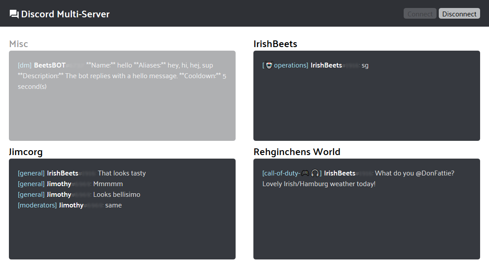

> Heavy work in progress. Subject to breaking changes.

# Discord Bot

Displays chat from Discord channels that a bot has joined, grouped by server membership. Node backend and React frontend, communicating via web sockets.

## Uses

-   [Discord.js](https://discordjs.guide)
-   [Socket.io](https://socket.io/)
-   [React](https://reactjs.org) / [Node](https://nodejs.org/en/)
-   [Express](https://expressjs.com/)

## Screenshot Example

## Env

`DISCORD_BOT_TOKEN`
